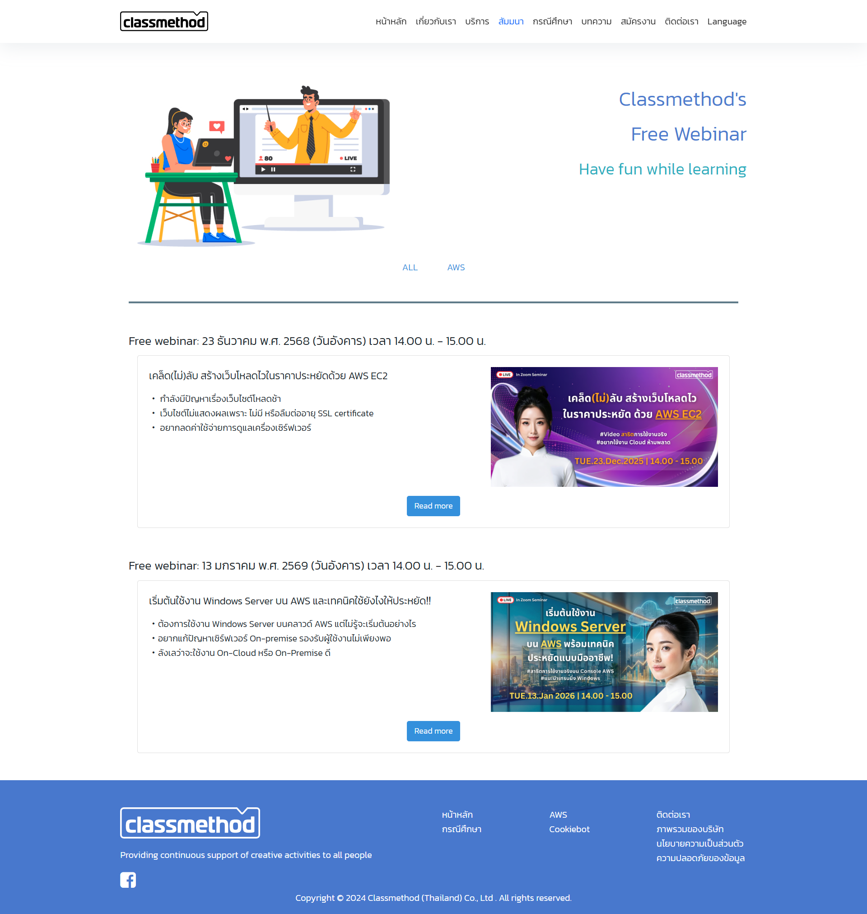
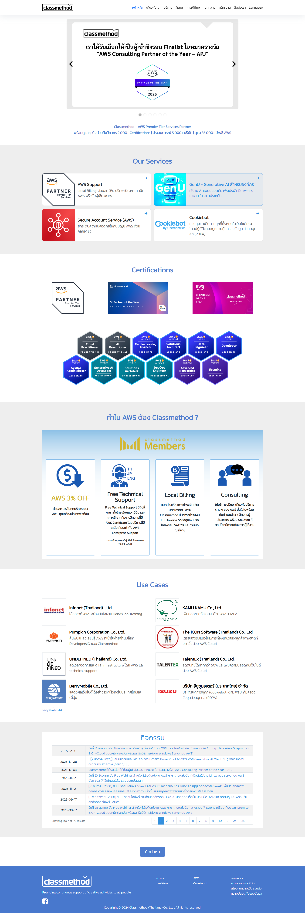
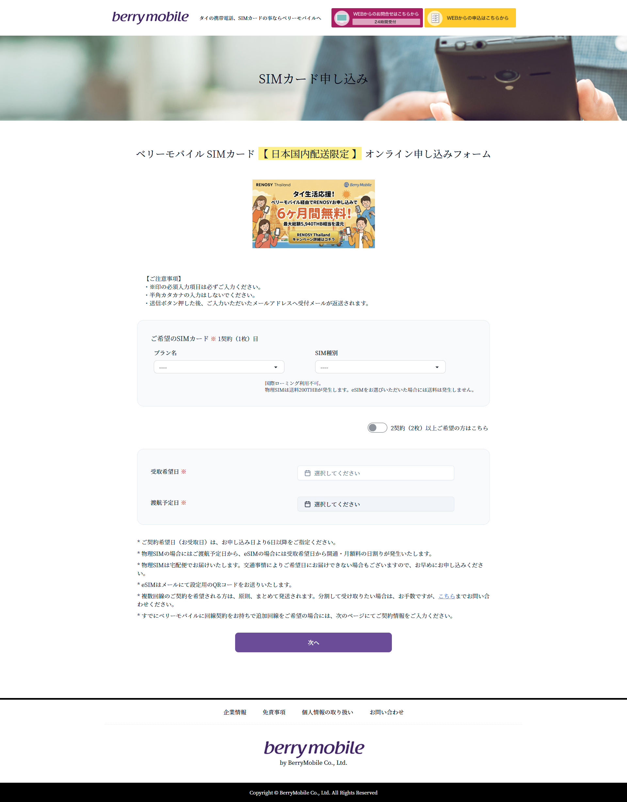
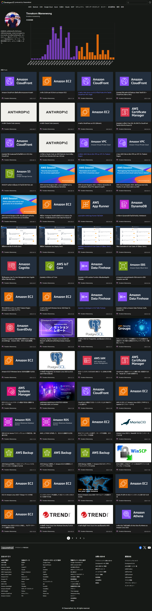

# Professional Experience
This document provides additional details about my work experience and the projects I was involved in during my time as a software engineer.

The purpose of this page is to explain the type of work I have been involved in, including website development, AWS-related activities, and internal technical support.

---

# Software Engineer  
Software Engineer (Web Development & AWS)
Classmethod (Thailand) Co., Ltd.
Sep 2020 – Jan 2026

During my time at Classmethod Thailand, I worked mainly on website development and tasks related to AWS cloud environments. My role involved supporting website development, updating website content, and assisting with server operations.

I was also involved in several other activities such as writing technical articles about AWS, supporting customer training sessions, and assisting internal teams with technical issues.

Although my main focus was web development, my work sometimes required supporting multiple areas depending on the needs of the team.

---

# Website Development and Maintenance
One of my regular responsibilities was updating and maintaining the company's official website. The website is used to publish company information, announcements, and seminar events.

My responsibilities mainly involved publishing website content, updating pages when necessary, and helping ensure that the website operated correctly on the server environment.

Website example  
https://www.classmethod.co.th/th/seminar-list  
(*Content on this page is updated regularly.)

### Responsibilities
- Updated website content such as announcements and seminar information
- Assisted in publishing website updates to the production server
- Helped maintain the website environment running on AWS
- Made small improvements to website layout and functionality when necessary

### Website Layout Updates and Improvements
In addition to maintaining website content, I also helped update certain parts of the website layout when changes were required.

This work mainly involved adjusting page layout and updating visual elements to improve how company information and services were presented.

Website  
https://www.classmethod.co.th/  
(*The content and layout of this page may have changed since my involvement.)

#### Work involved
- Updated layout elements on the website homepage
- Adjusted visual components used to present company services
- Implemented front-end updates using HTML and CSS
- Assisted in publishing the updated content to the production environment

---

# Laravel Migration Project
I participated in a project where an existing web system was migrated from plain PHP to the Laravel framework. The goal of this work was to improve the structure of the application and make future maintenance easier.

My role in this project mainly involved helping implement new features and adjusting the system so it could work properly under the Laravel framework.

Project website  
https://form.thaisim.jp/form  
(*Updated since my involvement.)

### Work involved
- Assisted with migrating the system from plain PHP to Laravel
- Helped implement image upload and download functionality
- Implemented email sending functionality using Laravel's MVC structure
- Made UI adjustments to improve usability for users

---

# Corporate Website Renewal Project
I also participated in a website renewal project aimed at improving both usability and maintainability.

The work involved migrating the existing system to Laravel and making several improvements to the user interface.

Project website  
https://www.sbcs.co.th/th/  
(*Updated since my involvement.)

### Work involved
- Assisted in migrating the website system from plain PHP to Laravel
- Implemented email sending functionality
- Helped improve the user interface and overall usability
- Participated in testing and verification of the system

---

# AWS Related Activities
In addition to development work, I was also involved in several AWS-related activities within the company.

These activities included writing technical articles about AWS services and assisting with introductory AWS training sessions for customers who were interested in learning about cloud technologies.

### Activities
- Wrote technical articles related to AWS and cloud technologies
- Assisted with introductory AWS training sessions for customers
- Supported internal teams with basic AWS-related questions when necessary

Articles  
https://dev.classmethod.jp/author/tinnakorn-maneewong/

---

# Technical Content Writing
Part of my work involved writing technical articles explaining AWS services and related technologies.

These articles were published on the company's technical blog and were intended to help developers and engineers better understand AWS.

In total, I contributed more than 300 articles covering different AWS topics.

The writing process usually involved researching AWS documentation, testing the service, and then writing step-by-step explanations.

---

# Media Support for AWS Seminars
I also helped support the preparation of materials used for online seminars and website content.

This work included creating and editing media materials using tools such as Adobe Premiere Pro and Adobe Photoshop.

The materials were mainly used for AWS-related seminars and website content.

### Work involved
- Assisted in creating visual materials for website content
- Edited seminar-related media using Adobe Premiere Pro
- Created graphics using Adobe Photoshop

---

# Internal Technical Support
In addition to development work, I occasionally helped provide technical support within the company.

This included helping colleagues troubleshoot IT-related issues and assisting when technical problems occurred.

### Work involved
- Helped troubleshoot IT-related issues
- Assisted with internal system problems
- Provided basic technical support when necessary

---

# Additional Work
From time to time, I also helped support other tasks depending on the needs of the team. These tasks included assisting with customer data management and helping support teams respond to customer inquiries.

Although these were not my primary responsibilities, I tried to support the team whenever possible.

### Work involved
- Assisted with customer data management
- Helped support communication related to AWS services
- Assisted the technical support team when needed

---

# Closing
Through my work experience, I had the opportunity to work on several areas including website development, AWS-related activities, technical writing, and internal technical support.

While I am still continuing to improve my skills, these experiences helped me understand how development work, cloud services, and team collaboration work together in a real work environment.

I hope to continue learning and improving my technical abilities while contributing to future development projects.
